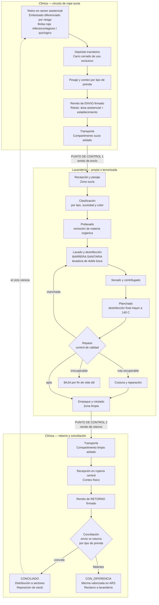
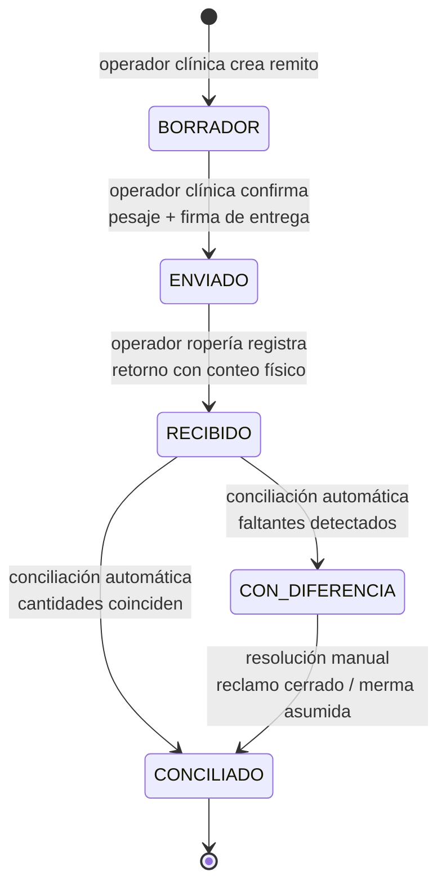

# Proceso normado de gestión de ropa hospitalaria — LavaTrack

> Documento de referencia funcional. Ubicación sugerida: `docs/PROCESO-LAVANDERIA.md`
> Última revisión: julio 2026 · BPSG Sistemas

---

## A. Marco normativo

| Norma / Fuente | Jurisdicción | Aporte al proceso |
|---|---|---|
| Manual de Procesos de Lavandería y Manejo de Ropa Hospitalaria — Ministerio de Salud de Neuquén (2024) | Provincial (referencia técnica más completa) | Define el circuito completo, exige sector sucio y sector limpio delimitados con accesos independientes, formaliza reparación de ropa y bajas |
| Ley 2.203 (CABA) + Decreto reglamentario 262/012 | CABA (referencia de mejores prácticas sector privado) | Bolsas diferenciadas por color con rótulo de área asistencial y establecimiento; carros lavables de cierre hermético y uso exclusivo; vehículo de transporte con división transversal limpio/sucio; obleas habilitantes para lavanderías y transportistas |
| Manual del Personal de Salud del Área de Lavandería — Decreto 522/13 | Provincia de Santa Fe (**marco aplicable al cliente**) | Roles y responsabilidades del personal de lavandería |
| Recomendaciones SADI — Comisión IACS y Seguridad del Paciente | Nacional (sociedad científica) | Manejo de ropa blanca, uniformes y telas en servicios de salud |
| Norma 28 — Hospital Italiano de Buenos Aires | Estándar de facto sector privado | Administración de ropa limpia y sucia, manejo de carros y bolsas |

### Principios rectores

1. **Marcha hacia adelante**: la ropa avanza siempre de zonas más sucias a zonas más limpias, nunca retrocede. Una prenda terminada no puede volver a una zona sucia.
2. **Barrera sanitaria**: separación física entre zona sucia y zona limpia. Lavadoras de doble boca: carga de ropa sucia por un lado, descarga de ropa limpia por el otro, sin contacto entre zonas.
3. **Toda ropa en contacto con pacientes se considera contaminada**: el embolsado en origen diferencia la ropa común de la de alto riesgo (infectocontagioso / quirúrgico → bolsa roja).
4. **Doble punto de control documental**: remito de envío (clínica → lavandería) y remito de retorno (lavandería → clínica), ambos firmados. La conciliación entre ambos es la fuente de detección de mermas.

---

## B. Diagrama de flujo completo del circuito

---

## C. Diagrama de estados del remito

Estados idénticos a los implementados en el sistema (`remitos.estado`).

Reglas asociadas:

- Un `ENVIO` solo puede vincularse a un único `RETORNO` (campo `remito_envio_id`).
- No se permite conciliar dos veces el mismo envío.
- Un `RETORNO` con cantidades mayores a las enviadas requiere flag de confirmación explícita.
- Toda transición genera movimientos en `movimientos_stock` (motivo `ENVIO` / `RETORNO`).
- Los faltantes de una conciliación `CON_DIFERENCIA` se valorizan con `tipos_prenda.costo_reposicion_ars`.

---

## D. Trazabilidad normativa → sistema

| Exigencia normativa | Fuente | Cobertura en LavaTrack | Estado |
|---|---|---|---|
| Embolsado diferenciado por riesgo (bolsa roja) | Ley 2.203 art. 4 / Manual Neuquén | `remito_items.cantidad_contaminada` | ✅ Implementado |
| Registro de peso por envío | Práctica estándar / facturación por kg | `remitos.peso_total_kg` | ✅ Implementado |
| Firma de recepción en cada entrega | Manual Neuquén / Norma 28 HIBA | `remitos.firmante` | ✅ Implementado (firma simple) |
| Conteo y conciliación envío vs retorno | Práctica estándar de control | `POST /api/remitos/:id/conciliar` + estados | ✅ Implementado |
| Registro de bajas por rotura / fin de vida útil | Manual Neuquén (reparación y baja) | Tabla `bajas` + `movimientos_stock` | ✅ Implementado |
| Rótulo normativo en remito impreso (área asistencial + establecimiento) | Ley 2.203 art. 4 inc. b | Impresión de remito | ⏳ PENDIENTE |
| Firma doble (quien entrega y quien recibe) | Ley 2.203 / Manual Neuquén | Requiere campo adicional `firmante_recepcion` | ⏳ PENDIENTE |
| Identificación del transportista con habilitación (oblea) | Ley 2.203 / Decreto 262/012 | Requiere entidad `transportistas` con nro. de habilitación | ⏳ PENDIENTE |
| Vida útil en ciclos de lavado por prenda | Práctica estándar (reposición programada) | `tipos_prenda.vida_util_ciclos` (dato cargado, sin contador de ciclos por lote) | 🔶 PARCIAL |

---

## E. Glosario operativo

| Término | Definición |
|---|---|
| Ropa contaminada | Toda ropa en contacto con pacientes; la de riesgo infectocontagioso o quirúrgico va en bolsa roja |
| Remito de envío | Documento firmado que acompaña la ropa sucia de la clínica a la lavandería, con detalle por tipo de prenda, cantidad y peso |
| Remito de retorno | Documento firmado que acompaña la ropa limpia de la lavandería a la ropería, base de la conciliación |
| Ropería central | Depósito de ropa limpia de la clínica desde donde se distribuye a los sectores según dotación |
| Dotación | Stock mínimo/máximo de cada tipo de prenda asignado a cada sector |
| Merma | Diferencia entre lo enviado y lo retornado, valorizada al costo de reposición |
| Baja | Salida definitiva de una prenda del circuito (rotura irrecuperable, fin de vida útil, pérdida) |
| Marcha hacia adelante | Principio por el cual la ropa avanza de zona sucia a limpia sin retroceder |
| Barrera sanitaria | Separación física entre zona sucia y limpia; lavadoras de doble boca |
