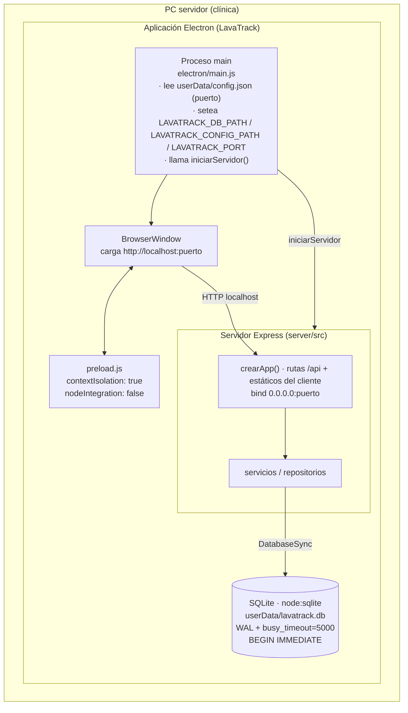
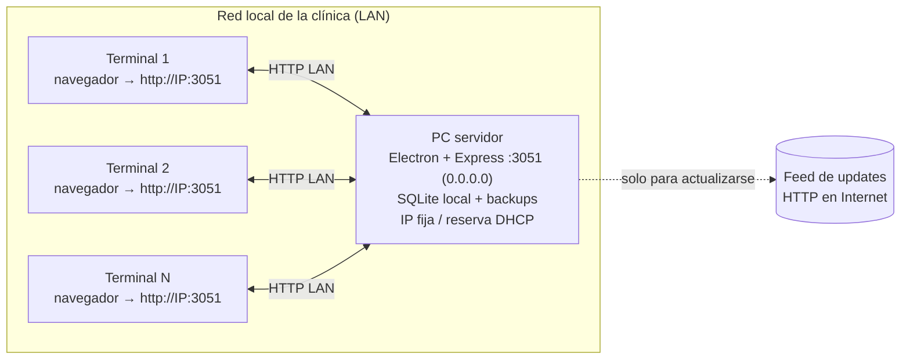
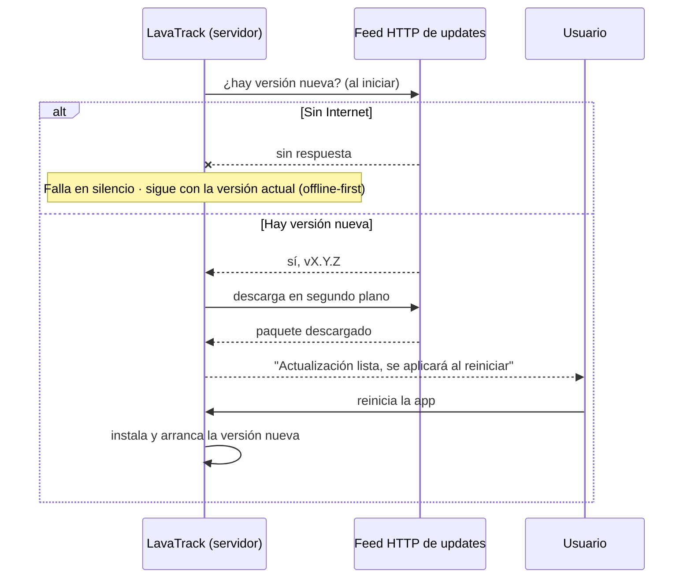

# LavaTrack Desktop — Arquitectura técnica

> Documento técnico del refactor "LavaTrack Desktop" (Electron + SQLite local + terminales LAN).
> Para el alcance del producto y el glosario ver [`PROYECTO-LAVATRACK.md`](./PROYECTO-LAVATRACK.md).
> Para instalar en la clínica ver [`DEPLOY.md`](./DEPLOY.md).

## Resumen

LavaTrack corre como una **aplicación de escritorio Electron** en una única PC (el **servidor**). El proceso *main* de Electron levanta el servidor Express que ya existía (`iniciarServidor()`) contra una base **SQLite local** en `userData`, y abre una ventana (`BrowserWindow`) apuntando a `http://localhost:<puerto>`. El backend se **envuelve**, no se reescribe.

Las demás PCs de la clínica son **terminales**: acceden con el navegador a `http://IP-del-servidor:<puerto>` por la LAN, sin instalar nada. Internet solo se usa para el auto-updater.

---

## 1. Componentes (dentro de la PC servidor)



Notas de diseño:
- **`node:sqlite`** (Node ≥ 22.5) se eligió para no arrastrar drivers nativos que requieran `electron-rebuild`.
- La ubicación de la base, la config y el puerto llegan al backend por **variables de entorno** que setea el proceso main (`LAVATRACK_DB_PATH`, `LAVATRACK_CONFIG_PATH`, `LAVATRACK_PORT`), de modo que el mismo código sirve en modo web/dev y dentro de Electron.
- El renderer (la ventana) es la **misma SPA** que ven las terminales; el shell no expone APIs privilegiadas más allá del `preload` acotado.

---

## 2. Topología de red (servidor + terminales LAN)



- El servidor hace **bind a `0.0.0.0`** para ser alcanzable desde la LAN (no solo `localhost`).
- Las terminales corren en **navegador puro** (Chrome/Edge), sin instalación. Pueden abrirse en modo aplicación: `chrome --app=http://IP:3051`.
- Cada terminal consulta `GET /api/health` periódicamente; si el servidor no responde, muestra un banner **"Sin conexión"** que **bloquea las escrituras** (evita perder datos contra un servidor caído).
- La página `GET /terminal-info` (servida por el propio servidor) lista las URLs de acceso de la LAN y el comando `chrome --app=...` para dar de alta terminales.
- **Internet es opcional**: solo lo usa el auto-updater. El circuito operativo funciona 100% offline dentro de la LAN.

---

## 3. Flujo de actualizaciones (electron-updater)



- Feed HTTP **genérico** (electron-updater), descarga en **segundo plano**, aplica **al reiniciar**.
- **Sin Internet no pasa nada**: no bloquea ni molesta (offline-first).
- **macOS**: el auto-update requiere firma de Apple Developer. Sin firma, la actualización en macOS se hace instalando el `.dmg` a mano (nota conocida, patrón heredado de StockFlow de BPSG). En Windows (NSIS) el auto-update funciona sin ese requisito.

---

## 4. Estrategia de backups

```mermaid
flowchart LR
  DB[("lavatrack.db<br/>(WAL activo)")] -->|VACUUM INTO<br/>copia consistente| TMP[".tmp-*.db"]
  TMP -->|gzip| GZ["lavatrack-AAAAMMDD-HHmmss.db.gz"]
  GZ --> DIR["userData/backups"]
  DIR -->|retención 30<br/>borra los más viejos| DIR
  DIR -.->|export manual| EXT["carpeta externa / pendrive"]
  GZ -.->|restore (menú)| RES["reemplaza lavatrack.db<br/>deja .pre-restore<br/>reinicia la app"]
```

- **Copia segura con WAL**: se usa `VACUUM INTO` (nunca se copia el archivo "en caliente"), luego **gzip**. Resultado: `lavatrack-AAAAMMDD-HHmmss.db.gz` en `userData/backups`.
- **Ciclo diario** + **retención 30** (se conservan los 30 backups más recientes).
- **Export/Restore desde el menú**: exportar copia un `.db.gz` a una ubicación externa; restaurar descomprime y **reemplaza** la base actual (deja una copia `.pre-restore` por las dudas) y **reinicia la app**. La restauración debe hacerse con el servidor detenido / antes de reabrir la base.

---

## 5. Rutas clave

Todas relativas a `app.getPath('userData')` de Electron (la ruta real de `userData` depende del SO y del usuario; en Windows suele ser `C:\Users\<usuario>\AppData\Roaming\LavaTrack`).

| Recurso | Ruta | Variable de entorno | Notas |
|---|---|---|---|
| Base de datos | `userData/lavatrack.db` | `LAVATRACK_DB_PATH` | SQLite `node:sqlite`, WAL. Genera además `lavatrack.db-wal` / `lavatrack.db-shm`. |
| Configuración | `userData/config.json` | `LAVATRACK_CONFIG_PATH` | `{ "puerto": 3051 }`. Editable desde Ajustes; cambiar el puerto requiere reiniciar. |
| Backups | `userData/backups/` | — | `*.db.gz` diarios, retención 30. |
| Puerto del servidor | (en `config.json`) | `LAVATRACK_PORT` | Default 3051. Express hace bind a `0.0.0.0`. |

> En modo web/dev (sin Electron) estas rutas caen por defecto bajo `server/data/` (`lavatrack.db`, `config.json`), útil para desarrollo.
